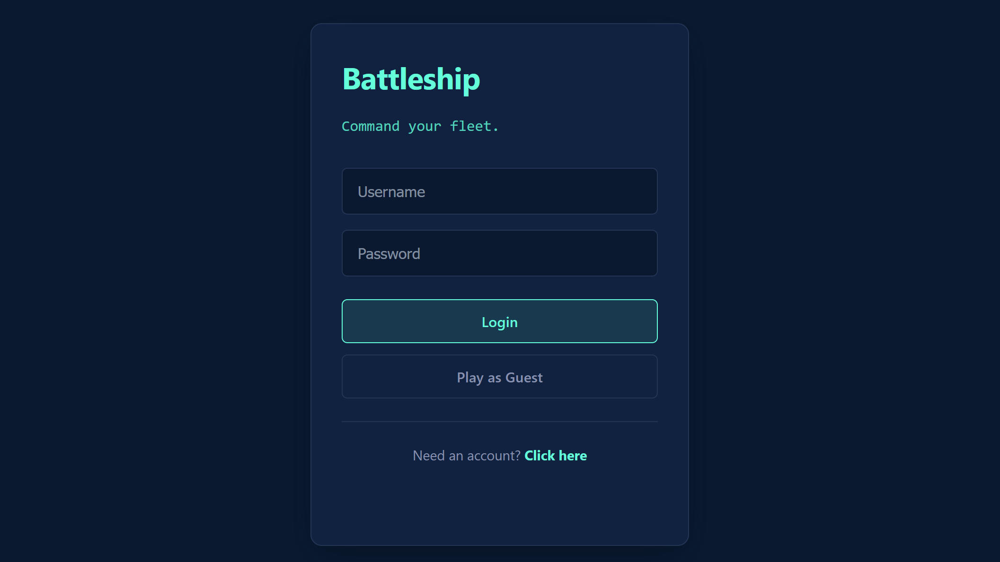
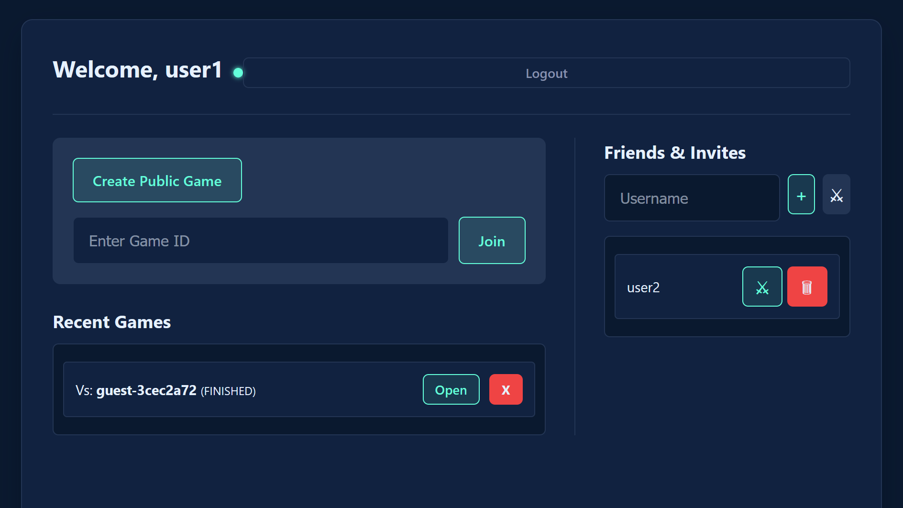
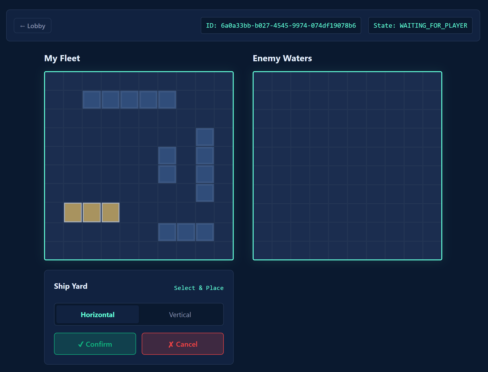
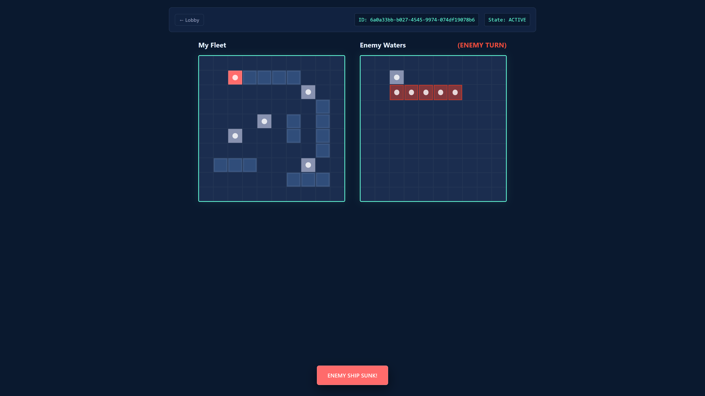
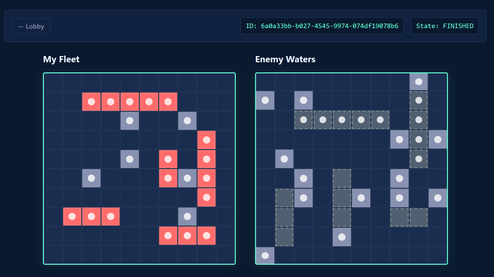

# 🚢 Battleship Enterprise

> A real-time, multiplayer naval strategy game built with **Hexagonal Architecture**, **WebSockets**, and **Spring Boot 3**.


---

## 📸 Screenshots


| **Log In Page** | **Lobby & Social Hub** | **Gameplay & Hover Effects** | **Active Gameplay** | **Game End** |
|-----------------|:----------------------:|:-----------------------------:|----------------------|--------------|
|  |  |  |  |  |
| *Log In & Play As Guest & Create Account* | *Real-time invites & friend list* | *Interactive placement & move validation* | *Shooting & Feedback* | *Result Of Game & Revealed Enemy Ships* |


---

## 📖 About The Project

This is not just a game; it is a demonstration of **Enterprise-Grade Software Architecture** applied to a complex domain.

The goal was to build a robust, scalable backend using **Hexagonal Architecture (Ports & Adapters)** to strictly separate the Game Logic (Domain) from the Framework (Spring/DB). This ensures that the core rules of Battleship are testable in isolation and independent of external technologies.

### Key Features
* **Real-Time Multiplayer:** Instant updates via **WebSockets (STOMP)**. No polling required.
* **Social Matchmaking:** Add friends, see who is online, and send direct **Challenges** with instant notifications.
* **Secure Authentication:** Full **Spring Security** integration with BCrypt password hashing and **Guest Mode** (ephemeral sessions).
* **Interactive UI:** Drag-and-drop style placement, hover previews, keyboard rotation (`R`), and sunk ship reveals.
* **Persistent History:** Games are stored in **PostgreSQL**. Users can "soft delete" games from their history without affecting opponents.
* **Robust Validation:** Server-side rule enforcement prevents cheating (duplicate shots, out-of-turn moves).

---

## 🏗️ Architecture & Project Structure

The project follows a strict **Hexagonal Architecture** (Ports & Adapters). This ensures the core `domain` logic remains isolated from external frameworks like Spring or the Database.

```text
src/main/java/com/frankint/battleship
├── api                             # 🟢 PRIMARY ADAPTERS (Entry Points)
│   ├── controller                  # REST & WebSocket Controllers
│   ├── dto                         # Data Transfer Objects (Contracts)
│   └── mapper                      # Converters (Domain <-> DTO)
│
├── application                     # 🟡 APPLICATION LAYER (Orchestration)
│   ├── port.out                    # Output Ports (Repository Interfaces)
│   └── service                     # Use Cases (GameService, SocialService)
│
├── domain                          # 🔴 DOMAIN CORE (Pure Java)
│   ├── model                       # Entities (Game, Board, Ship, State Machine)
│   └── exception                   # Business Logic Errors
│
└── infrastructure                  # 🔵 SECONDARY ADAPTERS (Implementation)
    ├── config                      # WebSocket & CORS Configuration
    ├── persistence                 # Database Logic
    │   ├── entity                  # JPA Entities (DB Schema)
    │   ├── jpa                     # Spring Data Repositories
    │   └── PostgresGameRepository  # The Adapter Implementation
    └── security                    # Spring Security & UserDetails
```

---

## 🚀 Getting Started

Follow these steps to get the game running on your local machine.

### Prerequisites
* **Java 21** or higher
* **Docker** & **Docker Compose**

### 1. Configuration (`.env` file)
Security best practices dictate that we do not commit credentials. You must create a `.env` file in the **root directory** of the project to configure the database credentials.

**Create a file named `.env`:**
```bash
# Copy this file to .env and fill in the values
POSTGRES_USER=user
POSTGRES_PASSWORD=change_me
POSTGRES_DB=battleship
POSTGRES_PORT=5434
```

### 2. Running with Docker (Recommended)
This is the easiest method. It uses a multi-stage build to compile and run the application entirely within Docker.

1.  **Start the Services:**
    ```bash
    docker-compose up --build
    ```
    *First-time setup will take a few minutes to download dependencies and compile the application.*

2.  **Access the Game:**
    Open [http://localhost:8080](http://localhost:8080).

### 3. Running Locally (For Development)
If you want to run the Java app in your IDE (IntelliJ/Eclipse) while running the Database in Docker.

1.  **Start only the Database:**
    ```bash
    docker-compose up -d postgres
    ```

2.  **Run the App:**

    ```bash
    ./mvnw spring-boot:run
    ```

---

## 🎮 How to Play

1.  **Login:** Create an account or use **"Play as Guest"**.
2.  **Lobby:**
    * **Public:** Click "Create Public Game" and share the Game ID.
    * **Social:** Add a friend by username and click **⚔ (Challenge)** to invite them instantly.
3.  **Setup:**
    * Select ships from the shipyard.
    * Press **`R`** to rotate.
    * Hover over the grid and click to confirm placement.
4.  **Battle:**
    * Take turns firing at the enemy grid.
    * **Red Border** = Sunk Ship.
    * First to sink all 5 ships wins!

---

## 🧪 Testing

The project emphasizes testing at the right levels:
* **Unit Tests:** JUnit 5 tests for the **Domain Layer** (Game Rules). Fast & isolated.
* **Integration Tests:** Spring Boot Tests using `@AutoConfigureMockMvc` and `@WithMockUser` to verify API security and database flows.

```bash
./mvnw test
```

---

## 🛠️ Tech Stack

* **Backend:** Java 21, Spring Boot 3.4
* **Communication:** WebSocket (SockJS + STOMP), REST API
* **Database:** PostgreSQL, Spring Data JPA
* **Security:** Spring Security, BCrypt
* **Frontend:** Vanilla JS (ES6), HTML5, CSS3 (No framework overhead)
* **DevOps:** Docker, Docker Compose, Maven

---

## 📜 License

Distributed under the MIT License. See `LICENSE` for more information.